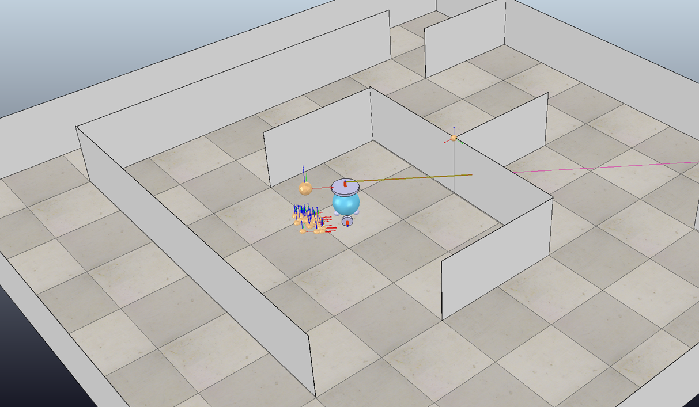

As part of a Robotics course, we built simulated robots in small teams that could accurately trace a route around a map, using predefined waypoints.
The robot, scripted in Lua within CoppeliaSim, used Monte Carlo localisation to iteratively gauge the likelihood of particles given sensor readings, resampling using this likelihood, and moving the particles based on odometry.

This was my first experience with Robotics and has inspired me to pursue it in the upcoming year, particular in combination with Machine Learning and potentially self-driving cars.
I have an amateur interest in transport engineering and, although the outcomes of autonomous vehicles are mixed in terms of benefits to safety against the potential to decrease public transport use, I am certainly interested at least in being in the conversation.

Whilst the simulated environment was necessary due to remote learning, it was useful to gain experience in it especially as the use of digital doubles and simulated learning and development environments increases.

Below you can see one of our robots in action. Intersecting walls, particles and estimated last waypoint position are all highlighted.
