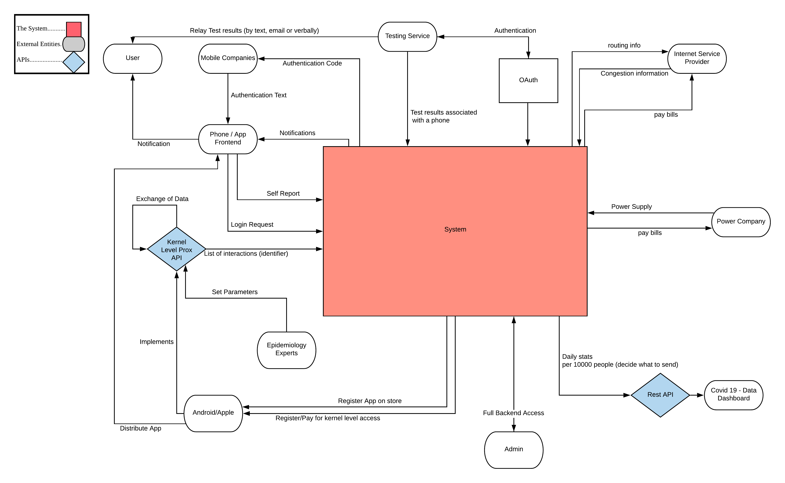
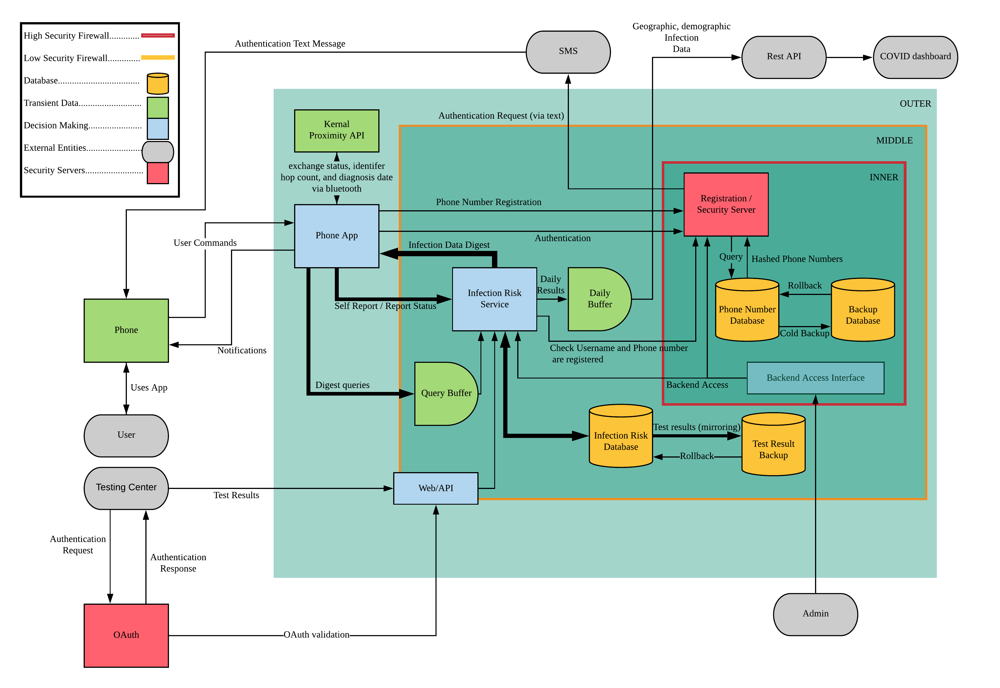
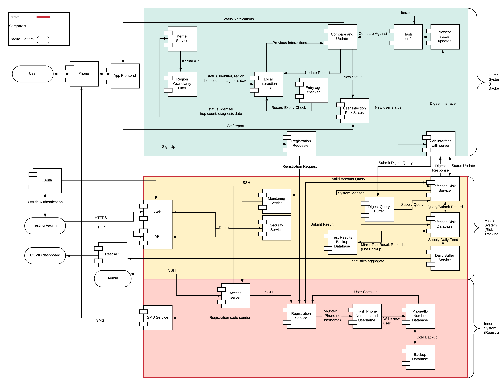

This project, conducted prior to the release of most major proposed/implemented track and trace algorithms, required the creation of work products detailing the proposed architecture at a range of levels of precision. 
We focused on privacy features that many left out whilst balancing realistic expectations of integration with existing NHS architecture.
The array of problems encouraged the proper delegation of tasks, including presentation giving and preparation, diagram design and review and architecture design of sections within the high-level concept. 
Within the team I took special notice of existing whitepapers and attempted to create a feasible cryptographic design, integrating reasonable constraints such as data, battery and storage use and finally providing such features as:

- Repeat sign up prevention
- Anonymised test result delivery
- Minimal (hashed phone number) personal data in remote storage

For example, see the system context, architecture overview and component diagrams respectively below.

  

      
  

  

      
  

  

      
  
  

